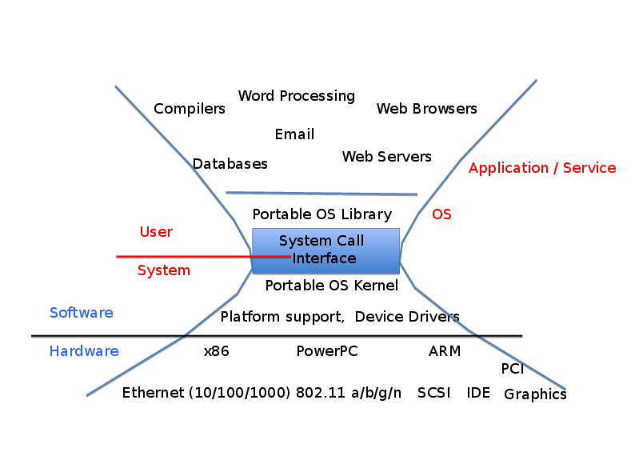

# Introduction to Process -- continued

## Context switch ##

- Switching between the user and kernel mode

### Transfer from the user mode to the kernel mode

- Done by hardware.
- Three types of mode transfer:
  - System call (syscall) -- synchronous (programmed), during an instruction;
  - Interrupt -- asynchronous (non-programmed), during an instruction;
  - CPU exception -- asynchronous (non-programmed), in between instructions.
- How does the kernel know which instruction to run upon a switch from a
  user process? -- Interrupt vector:


### Transfer from the kernel mode to the user mode

- Done by the kernel.
- Four types:
  - Start a new process;
  - Resume after a syscall, an interrupt, or a CPU exception;
  - Switch to another process;
  - User-level upcall.

## How is a user process represented in the OS?

- The kernel maintains for every process a Process Control Block (PCB)
- PCB contains
  - Process status (running, ready, blocked)
  - State of registers
  - Memory space
  - Process ID
  - User ID
  - Priority
  - Execution time
  - Etc.

- When a process is run, some of these values are copied into
  registers.

## How does the OS decide which process to run at any time

	
- The kernel has a component called scheduler who does this.  The
  scheduler maintains a data structure that contains PCBs for all
  active processes.
- The scheduler decides which process to run according to a scheduling
  mechanism.
- The basic operation of a scheduler looks like this:

    if ( readyProcesses( PCBs ) ) {
	    nextPCB = selectProcess( PCBs );
	    run( nextPCB );
    } else {
	    run_idle_process();
    }

- This a variety of scheduling algorithms, which we will study later.

# Introduction to file systems and I/O

- The software we write daily doesn't usually issue system calls -- they
are buried in the programming language's run-time library.

- A programming language's library has a component whose job is to
   talk to the operating system; for C this is
   [glibc](https://www.gnu.org/software/libc/).

- On the other hand, some software that we think of as part of the OS,
  such as shell and the window manager, run as user processes.

- In this lecture, we explore the layers of a computer system to see
  where the OS fits in; we will do so by exploring how the I/O and
  file systems work on a UNIX-like operating system (such as Linux). 

## Fundamental boundaries in a computer system:

- application software / system software boundary;
- the OS / user space boundary;
- the portable kernel / the software that deals with particular hardware boundary;
- hardware / software.



## We'll use I/O and file systems as an example of these layers

Why is I/O important in Unix? Unix is designed so that every entity on
the system is represented as a file, so communication with these entities
is achieved through reading to or writing from files.

Of particular interest are what we think of "normal" files, where we
store our data on persistent storage.

### Fundamental UNIX I/O design concepts

- Uniformity (everything is a file):
  - file operations, device I/O, interprocess communication are done
    in the same way, which allows for simple composition of programs
    (for example, using pipes).

- Open before use:
  - access control is done once, before doing any reads or writes on a
    file;
  - all necessary data structures within the OS are set up before any
    reads or writes are done.
	
- Explicit close:
  - clean-up once we're done with the file.

- I/O is byte-oriented:
  - A file is represented to applications as a numbered sequence of
    bytes regardless of what happens under the hood: whether we're
    dealing with character-oriented or block-oriented devices.

- Kernel-buffered reads and writes.

### The file-system abstraction

- File -- named collection of data in a file system. Contains
  - Data
  - Metadata
    - owner
	- size
	- modification time
	- access information

- Directory. Contains files, directories, and links.
  - Are arranged like an acyclical graph;
  - Every file is associated with a path in the directory graph (for
    example, `/home/dmitry/teaching/os/lecture-notes/lecture03`);
  - Paths can be absolute or relative (`.`, `..`, `~`).

- Hard and soft links (will be discussed later).

### Processes, file systems, and users are connected

- Every process has a number of files open for reading and writing.

- Every process has a current working directory.

- Every process has an owner.

### I/O layers

#### High-level I/O -- streams:

- A file is represented as a stream; we have to open a stream before
  we can read from or write to it.

```c
    #include <stdio.h>
    FILE *fopen( const char *filename, const char *mode );
    int fclose( FILE *fp );
```	

- Three predefined streams are opened implicitly when the program is executed:
  - FILE *stdin – default source of input; can be redirected;
  - FILE *stdout – default destination of output; can be redirected;
  - FILE *stderr – default destination of diagnostics and errors; can
    be redirected.

- Once a stream has been opened we can write to or read from it:

```c
    // character oriented  
    int fputc( int c, FILE *fp );			   
    int fputs( const char *s, FILE *fp );	

    int fgetc( FILE * fp );
    char *fgets( char *buf, int n, FILE *fp );

    // block oriented
    size_t fread(void *ptr, size_t size_of_elements, size_t number_of_elements, FILE *a_file);
    size_t fwrite(const void *ptr, size_t size_of_elements, size_t number_of_elements, FILE *a_file);

    // formatted
    int fprintf(FILE *restrict stream, const char *restrict format, ...);
    int fscanf(FILE *restrict stream, const char *restrict format, ... );
```

- We can go to a particular position in the file:

```c
    int fseek(FILE *stream, long int offset, int whence);
    long int ftell (FILE *stream);
    void rewind (FILE *stream);
```	
  
#### Low-level I/O -- handles on file descriptors:

-- We've now crossed the application software / system software boundary.

- A handle on file descriptor is a number that is returned by the `open`:

```c
    #include <fcntl.h>
    #include <unistd.h>
    #include <sys/types.h>


    int open (const char *filename, int flags [, mode_t mode]);
    int creat (const char *filename, mode_t mode);
    int close (int filedes);
```

- These numbers index into a file table, which contain all the
  information about open files.

- Standard streams are represented by numbers:

```c
    #include <unistd.h>

    STDIN_FILENO  // macro, has value 0
    STDOUT_FILENO // macro, has value 1
    STDERR_FILENO // macro, has value 2
```

- Once a file is open can perform operations on it:

```c
    ssize_t read (int filedes, void *buffer, size_t maxsize);
	ssize_t write (int filedes, const void *buffer, size_t size);

    off_t lseek (int filedes, off_t offset, int whence);

    int fsync (int fildes);
    void sync (void);
```

- Low-level I/O is much more powerful than high-level I/O

#### Syscall -- registers:

- We've now crossed the OS / user space boundary.

- One to one with low-level I/O: all the components of the signature
  of a low-level function correspond to registers where values are
  placed before the syscall happens.

- Within the kernel the file system is implemented as a collection of inodes:
   - Every file is represented by an inode, a data structure inside the
     kernel;
   - Every open file that is represented in the file table is
     connected to a corresponding inode;
   - All the reads and writes on files change the inode corresponding
     to that file.

#### I/O driver -- data transfer:

- We've crossed the portable kernel / the software that deals with particular hardware boundary.

- The kernel itself doesn't speak directly to the hardware devices;
     these is done to software called device drivers.

#### Hardware -- disks, SSD, controllers, etc.

- We've now crossed the software/hardware boundary.

## Linux commands to explore

`pwd`

`cd`

`ls` (in particular, check out the `i` option)

`ln`


