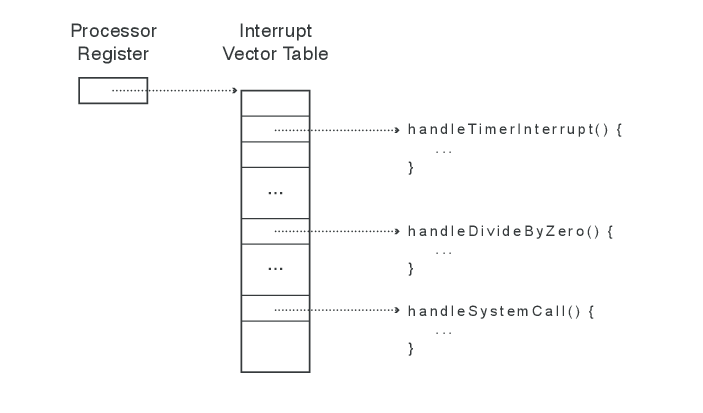

# Introduction to Process -- continued

## Context switch ##

- Switching between the user and kernel mode

### Transfer from the user mode to the kernel mode

- Done by hardware.
- Three types of mode transfer:
  - System call (syscall) -- synchronous (programmed), during an instruction;
  - Interrupt -- asynchronous (non-programmed), in between instructions;
  - CPU exception -- asynchronous (non-programmed), during an instruction.
- How does the kernel know which instruction to run upon a switch from a
  user process? -- Interrupt vector:

### Transfer from the kernel mode to the user mode

- Done by the kernel.
- Four types:
  - Start a new process;
  - Resume after a syscall, an interrupt;
  - Switch to another process;
  - User-level upcall.

## How is a user process represented in the OS?

- The kernel maintains for every process a Process Control Block (PCB)
- PCB contains
  - Process status (running, ready, blocked)
  - State of registers
  - Memory space
  - Process ID
  - User ID
  - Priority
  - Execution time
  - Etc.

- When a process is run, some of these values are copied into
  registers.

## How does the OS decide which process to run at any time

	
- The kernel has a component called scheduler who does this.  The
  scheduler maintains a data structure that contains PCBs for all
  active processes.
- The scheduler decides which process to run according to a scheduling
  mechanism.
- The basic operation of a scheduler looks like this:

    if ( readyProcesses( PCBs ) ) {
	    nextPCB = selectProcess( PCBs );
	    run( nextPCB );
    } else {
	    run_idle_process();
    }

- This a variety of scheduling algorithms, which we will study later.

